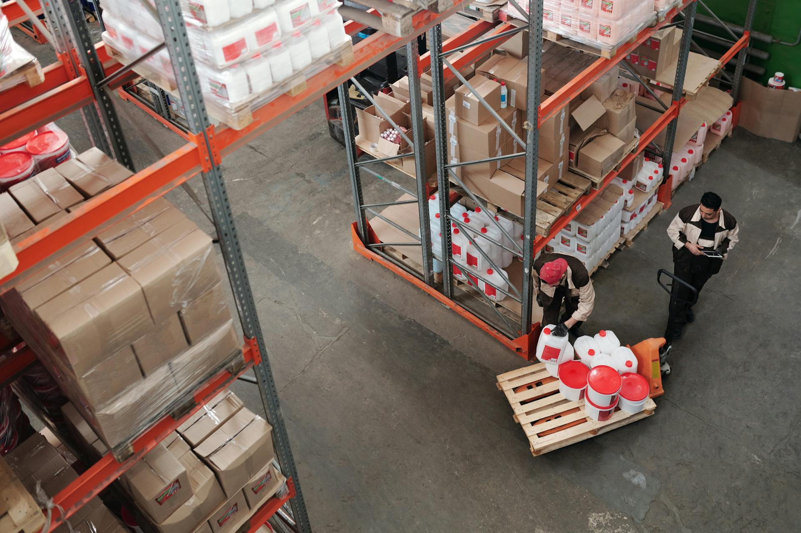

# 📚 GUIDE DES ILLUSTRATIONS - Nouvelle Leader Mar

**Comment utiliser et optimiser les illustrations du site**

---

## 🎯 OBJECTIF DE CE GUIDE

Ce document explique comment:
1. ✅ Utiliser les illustrations actuelles
2. ✅ Remplacer par de vraies photos de l'entreprise
3. ✅ Optimiser les images pour le web
4. ✅ Maintenir la cohérence visuelle

---

## 📸 IMAGES ACTUELLES

### Hero Slider (5 images)
| # | Fichier | Description | Taille | Usage |
|---|---------|-------------|--------|-------|
| 1 | `pexels-fauxels-3184578.jpg` | Équipe professionnelle | ~500KB | Slide 1 |
| 2 | `pexels-olia-danilevich-5313361.jpg` | Logistique | ~450KB | Slide 2 |
| 3 | `pexels-tiger-lily-4481327.jpg` | Commerce | ~520KB | Slide 3 |
| 4 | `pexels-tima-miroshnichenko-6169170.jpg` | Distribution | ~480KB | Slide 4 |
| 5 | `pexels-tima-miroshnichenko-6169668.jpg` | Import-Export | ~510KB | Slide 5 |

### Section "À propos" (1 image)
| Fichier | Description | Taille | Usage |
|---------|-------------|--------|-------|
| `pexels-tiger-lily-4481529.jpg` | Équipe + Entrepôt | ~490KB | About section |

### Section "Why Choose Us" (3 images)
| # | Fichier | Description | Taille | Usage |
|---|---------|-------------|--------|-------|
| 1 | `pexels-tiger-lily-4481531.jpg` | Stock/Entrepôt | ~470KB | Carte Stock |
| 2 | `pexels-hellochemo-3704162.jpg` | Livraison | ~430KB | Carte Livraison |
| 3 | `pexels-twosix-zerofive-771736124-29841077.jpg` | Commerce B2B | ~550KB | Carte Prix |

**Total**: 9 images, ~4.4 MB

---

## 🔄 COMMENT REMPLACER PAR VOS VRAIES PHOTOS

### Étape 1: Prendre les photos

#### Photos recommandées:

**Pour le Hero Slider (5 photos)**:
1. **Équipe au travail** - Votre équipe dans l'entrepôt ou au bureau
2. **Vue de l'entrepôt** - Rayonnages avec produits
3. **Livraison** - Camion ou véhicule avec logo Nouvelle Leader Mar
4. **Produits** - Assortiment de produits alimentaires que vous vendez
5. **Port/Container** - Si activité import-export maritime

**Pour la section "À propos" (1 photo)**:
- Photo de l'équipe complète devant l'entrepôt ou à l'intérieur
- Alternative: Vue de l'entrepôt avec produits bien rangés

**Pour "Why Choose Us" (3 photos)**:
1. **Stock** - Rayonnages de l'entrepôt, produits stockés
2. **Livraison** - Véhicule de livraison, équipe en action
3. **Commerce** - Poignée de main, signature de contrat, ou produits

---

### Étape 2: Préparer les photos

#### Spécifications techniques:

**Format**: JPG (meilleur compromis qualité/poids)

**Dimensions recommandées**:
- Hero Slider: 1920×1080px (Full HD)
- Section "À propos": 1200×800px
- Cartes "Why Choose Us": 800×600px

**Qualité**: 80-85% (bon compromis)

**Poids maximum**:
- Hero Slider: 200-300 KB par image
- Autres sections: 100-150 KB par image

---

### Étape 3: Optimiser les photos

#### Option 1: En ligne (gratuit)
1. Aller sur https://tinypng.com ou https://squoosh.app
2. Uploader votre photo
3. Télécharger la version compressée

#### Option 2: Logiciel (professionnel)
1. Photoshop: "Save for Web" → JPG, Qualité 80
2. GIMP: Exporter → JPG, Qualité 85
3. XnConvert (gratuit): Batch processing

#### Checklist d'optimisation:
- [ ] Dimensions correctes (voir ci-dessus)
- [ ] Format JPG
- [ ] Qualité 80-85%
- [ ] Poids < 300 KB
- [ ] Nom de fichier descriptif (ex: `nlm-entrepot-marcory.jpg`)

---

### Étape 4: Remplacer les images

#### Hero Slider - [index.html](index.html) lignes 76-99

**Avant**:
```html

```

**Après** (exemple):
```html

```

Répéter pour les 5 slides.

---

#### Section "À propos" - [index.html](index.html) ligne 234

**Avant**:
```html

```

**Après** (exemple):
```html

```

---

#### Cartes "Why Choose Us" - [index.html](index.html) lignes 358, 385, 413

**Carte 1 - Stock**:
```html

```

**Carte 2 - Livraison**:
```html

```

**Carte 3 - Prix**:
```html

```

---

## 🎨 MAINTENIR LA COHÉRENCE VISUELLE

### Règles pour les photos

#### 1. **Éclairage**
✅ Bien éclairé (naturel ou artificiel)
❌ Pas de photos sombres ou sous-exposées

#### 2. **Netteté**
✅ Photos nettes, pas floues
❌ Pas de photos mouvementées

#### 3. **Composition**
✅ Sujet centré ou règle des tiers
❌ Pas de composition déséquilibrée

#### 4. **Cohérence**
✅ Style similaire pour toutes les photos
❌ Pas de mélange de styles trop différents

---

### Couleurs et filtres

**Ne PAS appliquer de filtre**:
- Les overlays du site appliquent déjà un gradient bleu royal → turquoise
- Gardez les couleurs naturelles de vos photos

**Si vous voulez harmoniser**:
1. Légère correction de luminosité/contraste OK
2. Saturation légèrement réduite (-10% max) pour look pro
3. Pas de filtres Instagram/vintage

---

## 🚀 OPTIMISATION AVANCÉE

### Utiliser le format WebP (optionnel)

**Avantages**:
- 30% plus léger que JPG
- Meilleure qualité à poids égal

**Méthode**:
1. Convertir vos JPG en WebP (https://squoosh.app)
2. Créer des versions fallback JPG
3. Utiliser la balise `<picture>`:

```html
<picture>
    <source srcset="images/nlm-equipe.webp" type="image/webp">
    
</picture>
```

---

### Lazy Loading (optionnel)

Ajouter `loading="lazy"` pour charger les images au scroll:

```html

```

**Avantages**:
- Page charge plus vite
- Économise la bande passante

**À appliquer sur**:
- Section "À propos"
- Cartes "Why Choose Us"

**Ne PAS appliquer sur**:
- Hero Slider (doit charger immédiatement)

---

## 📝 BONNES PRATIQUES

### Alt Text (texte alternatif)

**Importance**:
- Accessibilité (lecteurs d'écran)
- SEO (Google Images)
- Affiché si image ne charge pas

**Règles**:
- Descriptif et précis
- Inclure "Nouvelle Leader Mar"
- Inclure le contexte

**Exemples**:

✅ **Bon**:
```html

```

❌ **Mauvais**:
```html


```

---

### Noms de fichiers

**Règles**:
- En minuscules
- Tirets (-) au lieu d'espaces
- Descriptif
- Pas de caractères spéciaux

**Exemples**:

✅ **Bon**:
```
nlm-equipe-entrepot-2025.jpg
nlm-camion-livraison-abidjan.jpg
nlm-stock-produits-alimentaires.jpg
```

❌ **Mauvais**:
```
IMG_1234.jpg
Photo 1.jpg
ÉQUIPE ENTREPÔT.JPG
```

---

## 🔍 CHECKLIST AVANT MISE EN LIGNE

### Pour chaque image:
- [ ] Dimensions correctes (voir tableau ci-dessus)
- [ ] Format JPG (ou WebP + JPG fallback)
- [ ] Qualité 80-85%
- [ ] Poids < 300 KB
- [ ] Nom de fichier descriptif
- [ ] Alt text rempli et pertinent
- [ ] Photo nette et bien éclairée
- [ ] Composition équilibrée

### Test global:
- [ ] Toutes les images chargent correctement
- [ ] Overlays du logo s'affichent bien
- [ ] Hover effects fonctionnent
- [ ] Responsive OK (mobile/tablet/desktop)
- [ ] Temps de chargement < 3 secondes

---

## 📊 AMÉLIORATION CONTINUE

### Phase 1: Court terme (maintenant)
✅ Utiliser les images actuelles (Pexels)
✅ Site opérationnel immédiatement

### Phase 2: Moyen terme (1-2 semaines)
1. Organiser une séance photo professionnelle:
   - Équipe
   - Entrepôt
   - Produits
   - Véhicules de livraison

2. Remplacer les images Pexels par vos photos

### Phase 3: Long terme (1-3 mois)
1. Ajouter galerie de réalisations
2. Ajouter témoignages clients avec photos
3. Créer catalogue produits illustré
4. Ajouter vidéo de présentation de l'entreprise

---

## 💡 IDÉES DE PHOTOS FUTURES

### Pour galerie de réalisations:
- Photos de clients satisfaits (avec autorisation)
- Photos de livraisons importantes
- Photos de containers import-export
- Photos d'événements (salons, foires)

### Pour témoignages:
- Photos de clients avec leurs produits reçus
- Photos de partenariats (signatures de contrats)
- Photos de locaux de clients approvisionnés

### Pour catalogue produits:
- Photos de produits phares
- Photos d'assortiments
- Photos de nouveautés
- Photos de promotions

---

## 🛠️ OUTILS RECOMMANDÉS

### Gratuits
- **Compression**: TinyPNG, Squoosh
- **Retouche basique**: Photopea (Photoshop en ligne)
- **Conversion**: CloudConvert
- **Dimensions**: BulkResizePhotos

### Payants (professionnels)
- **Retouche**: Adobe Photoshop, Lightroom
- **Batch processing**: XnConvert Pro
- **Compression avancée**: ImageOptim (Mac), FileOptimizer (Windows)

---

## 📞 BESOIN D'AIDE ?

### Pour remplacer les images:
1. Préparez vos photos selon les specs ci-dessus
2. Renommez-les avec des noms descriptifs
3. Copiez-les dans le dossier `images/`
4. Modifiez les liens dans `index.html` (voir Étape 4)

### Pour optimiser:
1. Utilisez TinyPNG ou Squoosh
2. Visez < 300 KB par image
3. Vérifiez la qualité après compression

### Pour tester:
1. Ouvrez `index.html` dans votre navigateur
2. Vérifiez que toutes les images s'affichent
3. Testez les hover effects
4. Testez sur mobile/tablette

---

## ✅ RÉSUMÉ

**Images actuelles**: 9 images Pexels professionnelles
**Poids total**: ~4.4 MB
**Optimisation possible**: Réduction à ~2 MB avec WebP

**Prochaines étapes**:
1. ✅ Utiliser le site tel quel (opérationnel)
2. 📸 Organiser séance photo de votre entreprise
3. 🔄 Remplacer progressivement les images
4. 🚀 Continuer à enrichir avec plus de visuels

**Objectif final**:
> Un site 100% illustré avec de vraies photos de Nouvelle Leader Mar, montrant votre équipe, votre entrepôt, vos produits et vos livraisons en action.

---

**Questions fréquentes**:

**Q: Combien de photos dois-je prendre ?**
R: Minimum 9 (pour remplacer les actuelles), idéalement 15-20 pour avoir du choix.

**Q: Puis-je utiliser mon smartphone ?**
R: Oui, si récent (iPhone 12+, Samsung Galaxy S20+). Privilégiez un photographe pro si possible.

**Q: Faut-il tout remplacer d'un coup ?**
R: Non, vous pouvez remplacer progressivement (commencez par le Hero Slider).

**Q: Les overlays vont-ils fonctionner avec mes photos ?**
R: Oui, les gradients s'appliquent automatiquement. Assurez-vous juste que vos photos sont bien éclairées.

---

**Version**: 1.0
**Date**: Novembre 2025
**Pour**: Équipe Nouvelle Leader Mar
